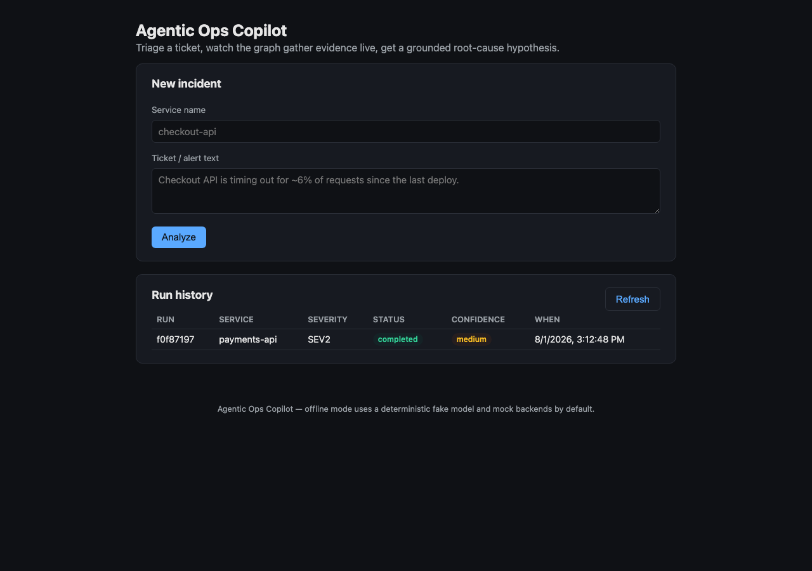
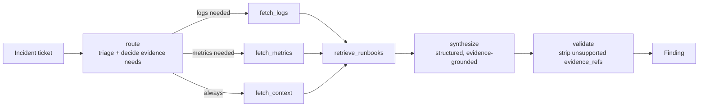
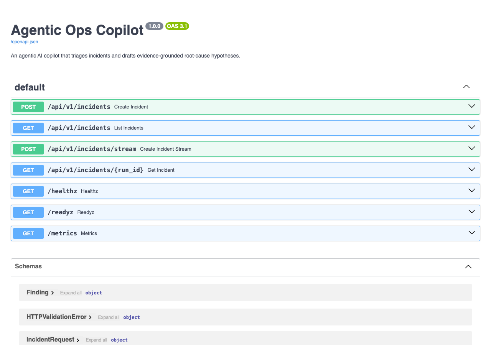

# Agentic Ops Copilot

**Agentic AI Operations Copilot** — an AI agent for on-call/support engineers that triages a ticket, gathers logs/metrics/service-context evidence in parallel, retrieves relevant runbooks, and drafts a grounded root-cause hypothesis instead of a human doing it manually across five tabs.

Runs **fully offline out of the box** — zero API keys, zero external services required — and is production-ready: typed adapters for real backends, a REST + streaming API, a dashboard, Docker, CI, and a test suite.



## Table of contents

- [Why it matters](#why-it-matters)
- [Architecture](#architecture)
- [Quickstart](#quickstart)
- [Installation guide](#installation-guide)
- [Configuration](#configuration)
- [Using it](#using-it)
- [API reference](#api-reference)
- [Docker](#docker)
- [Plugging in real backends](#plugging-in-real-backends)
- [Testing](#testing)
- [Project layout](#project-layout)
- [Troubleshooting](#troubleshooting)
- [Full project documentation](docs/PROJECT_DOCUMENTATION.md) — everything done in this project, in depth

## Why it matters

Mirrors the shape of an AI support agent grounded strictly in retrieved evidence — the same pattern used in production for support/on-call copilots (Bedrock Agent + Kendra-style GenAI retrieval) that cut incident response from a manual, multi-tab investigation to near-instant, evidence-backed triage.

The core guarantee: **the copilot will not invent a root cause it can't support with evidence actually collected during the run.** Every claim the model makes is checked against what was really fetched; unsupported claims are stripped and the finding is downgraded to "insufficient evidence" instead of shipping a confident guess.

## Architecture



- **`route`** is the router agent: it classifies severity/category from the ticket text and decides *which* evidence sources are actually relevant — a billing question skips log/metric collection entirely.
- **`fetch_logs` / `fetch_metrics` / `fetch_context`** run truly in parallel as a LangGraph conditional fan-out; each node returns only its own state key so concurrent branches never race on the same write.
- **`synthesize`** calls the LLM with `with_structured_output(Finding)` — the model must return a typed object, not free text.
- **`validate`** is the enforced guardrail: every `evidence_refs` entry the model cites is checked against evidence that was actually collected this run. Anything fabricated is stripped; a finding with nothing left is downgraded to `insufficient_evidence`.

A SQLite checkpointer persists graph state across runs/restarts, so history survives a redeploy.

## Quickstart

Requires Python 3.10+.

```bash
git clone <this-repo>
cd Agentic-ops-copilot
pip install -e .
ops-copilot serve
```

Open **http://localhost:8000** — submit the pre-filled sample incident and watch it triage live. No API key, no external service, nothing else to configure.

## Installation guide

### 1. Clone and create a virtual environment

```bash
git clone <this-repo>
cd Agentic-ops-copilot
python3 -m venv .venv
source .venv/bin/activate      # Windows: .venv\Scripts\activate
```

### 2. Install

```bash
pip install -e .            # core install — runs fully offline
pip install -e ".[dev]"     # + test/lint/typecheck tooling
pip install -e ".[openai]"  # + real OpenAI provider
pip install -e ".[bedrock]" # + Amazon Bedrock provider
pip install -e ".[retrieval]" # + real vector retrieval (Chroma + OpenAI embeddings)
```

Extras compose: `pip install -e ".[openai,retrieval,dev]"`.

### 3. (Optional) configure

```bash
cp .env.example .env
# edit .env — every setting has a working default, so this step is optional
```

### 4. Run it

```bash
ops-copilot serve                                  # API + dashboard on :8000
ops-copilot analyze "<ticket text>" --service svc   # one-shot CLI run
ops-copilot backends                                # print resolved config
```

or the legacy one-shot demo the original prototype documented:

```bash
python agentic_ops_copilot.py
```

### 5. Run the tests

```bash
pip install -e ".[dev]"
pytest --cov=ops_copilot --cov-report=term-missing
ruff check . && ruff format --check .
mypy src/
```

or simply `make test`, `make lint`, `make typecheck`.

## Configuration

Everything is an environment variable prefixed `OPS_` (or a line in `.env` — see [`.env.example`](.env.example) for the full, commented list). Every setting has a working default; **the app runs with zero environment variables set at all** (LLM provider `fake`, backends `mock`).

| Setting | Default | Options |
|---|---|---|
| `OPS_LLM_PROVIDER` | `fake` | `fake`, `openai`, `bedrock` |
| `OPS_LLM_MODEL` | `gpt-4o-mini` | any model id for the chosen provider |
| `OPS_LOGS_BACKEND` | `mock` | `mock`, `loki` |
| `OPS_METRICS_BACKEND` | `mock` | `mock`, `prometheus` |
| `OPS_RETRIEVAL_ENABLED` | `true` | `true`, `false` |
| `OPS_EMBEDDINGS_PROVIDER` | `none` | `none` (in-memory store), `openai` (real Chroma vectors) |
| `OPS_API_KEY` | *(unset)* | set any value to require `X-API-Key` on every `/api/v1/*` request |
| `OPS_RATE_LIMIT_PER_MINUTE` | `60` | per-client-IP, per-worker (see note below) |
| `OPS_CHECKPOINT_DB_PATH` | `data/checkpoints.sqlite` | path to the run/checkpoint SQLite file |

**Rate limiting** is an in-process sliding window keyed by client IP — simple and dependency-free, but per-worker rather than global: with multiple uvicorn workers or replicas, each enforces the limit independently. `/healthz` and `/readyz` are exempt so liveness/readiness probes are never rate-limited under load. Exceeding the limit returns `429` with `Retry-After: 60`.

## Using it

### The dashboard

`ops-copilot serve` then open `http://localhost:8000`. Submit a service name and ticket text, watch live per-node progress via Server-Sent Events, see the grounded finding with its confidence and cited evidence, and browse run history.

### The CLI

```bash
ops-copilot analyze "Checkout API is timing out for ~6% of requests since the last deploy." --service checkout-api
```

```
╭─────────────────────────────────── Triage ────────────────────────────────────╮
│ severity=SEV2  category=deployment                                            │
╰─────────────────────────────────────────────────────────────────────────────────╯
╭─────────────────────────── Root-cause hypothesis ─────────────────────────────╮
│ - Database connection pool exhaustion is driving elevated latency and         │
│   5xx errors.                                                                 │
│                                                                                │
│ Recommended action: Roll back the most recent deploy if the timing            │
│ correlates; scale the affected resource pool as a mitigation.                 │
│ Confidence: medium  |  Evidence: logs, metrics, context, runbooks             │
╰─────────────────────────────────────────────────────────────────────────────────╯
```

(Mock backends select a scenario deterministically by service name — try a few different service names to see the `bad_deploy`, `dependency_outage`, and `insufficient_evidence` scenarios too.)

### The API

```bash
curl -X POST localhost:8000/api/v1/incidents \
  -H "Content-Type: application/json" \
  -d '{"ticket_text": "Checkout API is timing out for ~6% of requests since the last deploy.", "service_name": "checkout-api"}'
```

## API reference

Full interactive docs (OpenAPI/Swagger) are always served at **`/docs`**:



| Method | Path | Description |
|---|---|---|
| `POST` | `/api/v1/incidents` | Run an analysis, return the final result as JSON |
| `POST` | `/api/v1/incidents/stream` | Same, streamed as Server-Sent Events (live node progress) |
| `GET` | `/api/v1/incidents` | List recent runs |
| `GET` | `/api/v1/incidents/{run_id}` | Fetch one run |
| `GET` | `/healthz` | Liveness probe |
| `GET` | `/readyz` | Readiness probe — reports resolved provider/backends |
| `GET` | `/metrics` | Prometheus metrics |
| `GET` | `/docs` | OpenAPI/Swagger UI |

Set `OPS_API_KEY` to require an `X-API-Key` header on every `/api/v1/*` call; leave it unset for open access (fine for local/dev use).

## Docker

```bash
docker compose up --build
```

Brings up the service on `http://localhost:8000` with a persistent volume for run history. The image is a multi-stage, non-root build with a container `HEALTHCHECK` on `/healthz`.

To demo the real Prometheus/Loki adapters alongside it:

```bash
docker compose --profile real-backends up --build
```

## Plugging in real backends

Every ops tool is defined as a `typing.Protocol` in [`src/ops_copilot/tools/base.py`](src/ops_copilot/tools/base.py) — `LogsBackend`, `MetricsBackend`, `ServiceCatalog`. Two implementations ship today:

- **`mock`** (default): rich, deterministic, zero-setup scenarios — good for demos, tests, and CI.
- **one real adapter per capability**, as a concrete reference: [`prometheus.py`](src/ops_copilot/tools/prometheus.py) for metrics, [`loki.py`](src/ops_copilot/tools/loki.py) for logs.

To point at your own stack: implement the relevant protocol against your internal system (Datadog, Splunk, PagerDuty, your service catalog/CMDB, ...) and register it in [`tools/registry.py`](src/ops_copilot/tools/registry.py). No changes to the graph, guardrails, or API are needed.

LLM providers work the same way — see [`llm.py`](src/ops_copilot/llm.py): `fake` (default, deterministic, offline), `openai`, `bedrock`.

## Testing

```bash
make test       # pytest with coverage
make lint       # ruff check + format --check
make typecheck  # mypy
```

The suite (39 tests, ~86% coverage) runs fully offline against the `fake` LLM provider and `mock` backends — no API keys or network access required. It includes:

- A **zero-env import regression test** — the original prototype crashed on `import` without `OPENAI_API_KEY`; this test proves the package now imports and builds the graph in a completely scrubbed environment.
- Unit tests for config, the fake model's structured output (both the grounded and insufficient-evidence paths), guardrail enforcement, mock backends, and retrieval.
- Integration tests running the full graph end-to-end across multiple scenarios, including the parallel evidence fan-out, the router skipping irrelevant evidence sources, and a simulated backend failure that must degrade gracefully rather than crash the run.
- API tests (FastAPI `TestClient`-style, via `httpx.ASGITransport`) covering every endpoint, SSE streaming, auth, rate limiting, and history.
- Real-adapter tests (Prometheus/Loki) against `httpx` mock transports — no real network calls.

**Honest limit:** with no `OPENAI_API_KEY` or AWS credentials configured, the real OpenAI/Bedrock code paths and genuinely live Prometheus/Loki calls are not exercised by this suite — only their request/response handling logic is, via mocks. Everything reported as tested here is the offline suite.

## Project layout

```
src/ops_copilot/
  config.py        pydantic-settings — every setting has a working default
  schemas.py        typed contracts (IncidentRequest, Finding, RunRecord, ...)
  llm.py             lazy LLM provider factory: fake | openai | bedrock
  graph.py           the LangGraph state machine
  guardrails.py     evidence-grounding enforcement
  retrieval.py      runbook retrieval (Chroma or dependency-free in-memory)
  tools/            adapter protocols + mock/real backend implementations
  store.py           run-history persistence
  observability.py structured logging + Prometheus metrics
  api.py             FastAPI app (REST + SSE + embedded dashboard)
  cli.py             Typer CLI
  web/               the dashboard SPA (plain HTML/CSS/JS, no build step)
runbooks/            sample runbooks used by retrieval
tests/               unit + integration tests
```

## Troubleshooting

- **`database is locked`**: two processes are writing to the same SQLite checkpoint file at once. Point `OPS_CHECKPOINT_DB_PATH` at separate files for separate processes (this is set automatically per-test).
- **`ModuleNotFoundError: langchain_openai` / `langchain_aws` / `langchain_chroma`**: install the matching extra, e.g. `pip install -e ".[openai]"`.
- **Dashboard prompts for an API key**: this happens when `OPS_API_KEY` is set — the dashboard prompts once on the first `401`, then remembers the key in the browser's `localStorage` for subsequent requests. Clear it via your browser's dev tools if you need to re-enter it.
- **`429 rate limit exceeded`**: you've hit `OPS_RATE_LIMIT_PER_MINUTE` for your client IP on this worker process; wait for the `Retry-After` window or raise the setting.
- **A finding cites `logs`/`metrics`/`context` I didn't expect, or a source is missing with no explanation**: check `RunRecord.degraded` in the response — if the source is listed there, the real backend (Prometheus/Loki/etc.) failed or timed out during this run rather than being skipped by the router; the run still completes with whatever evidence *was* collected.
